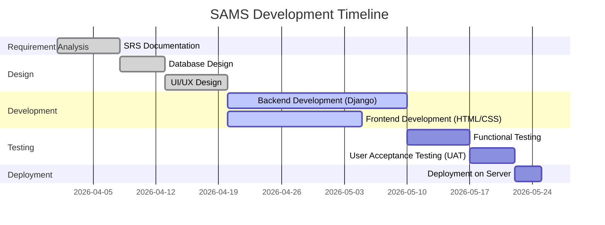
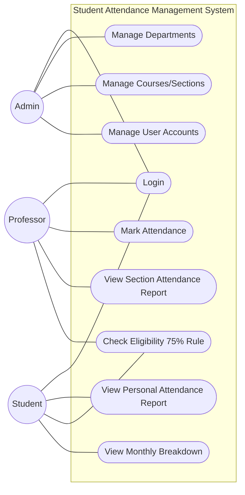
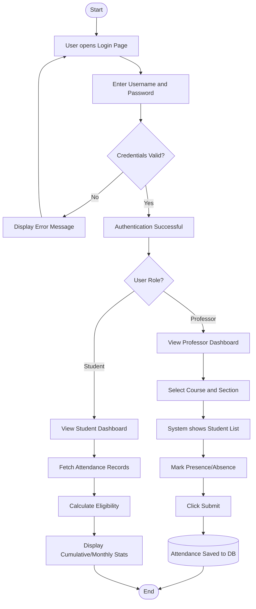
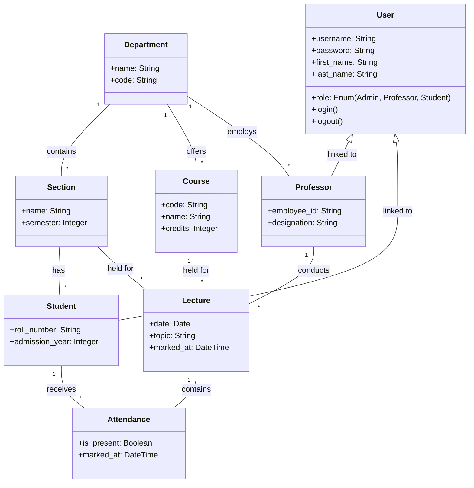
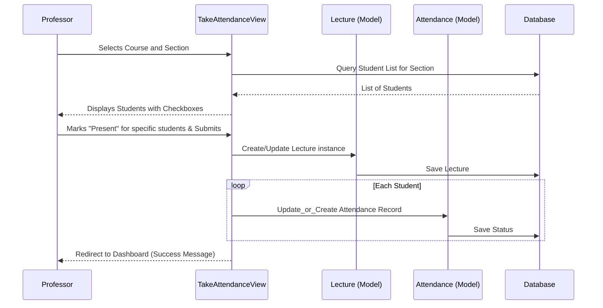
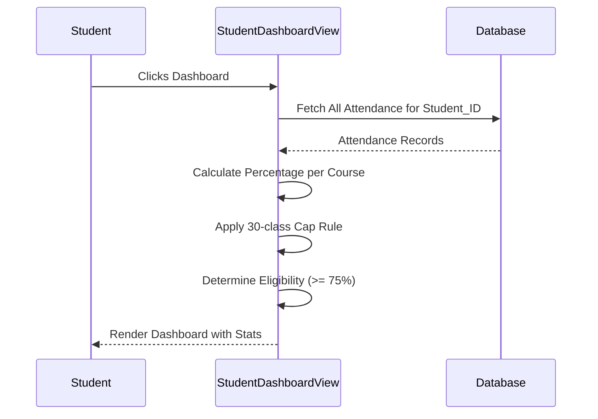
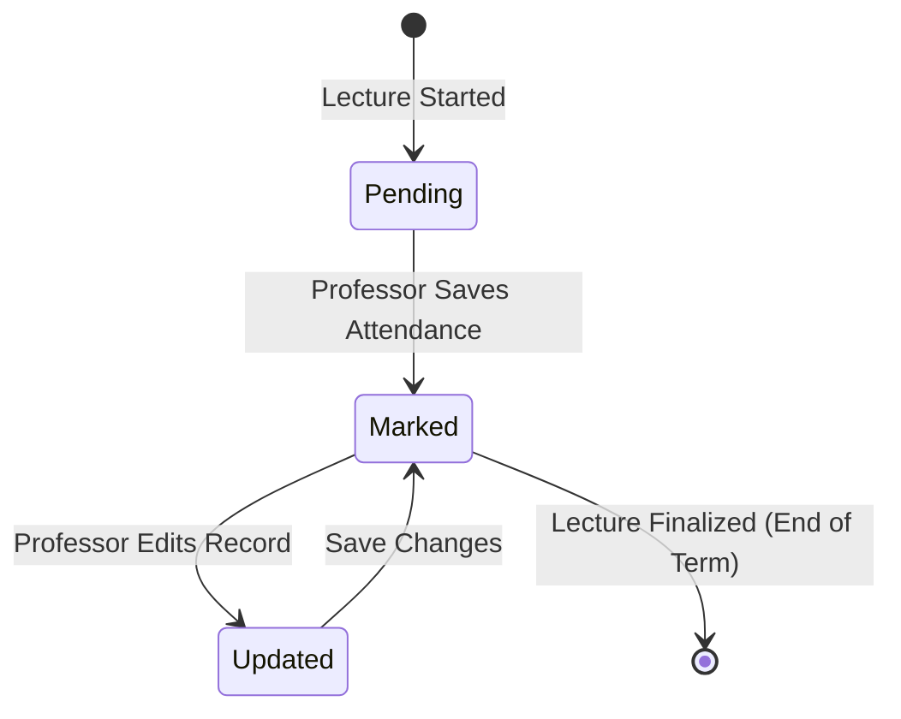
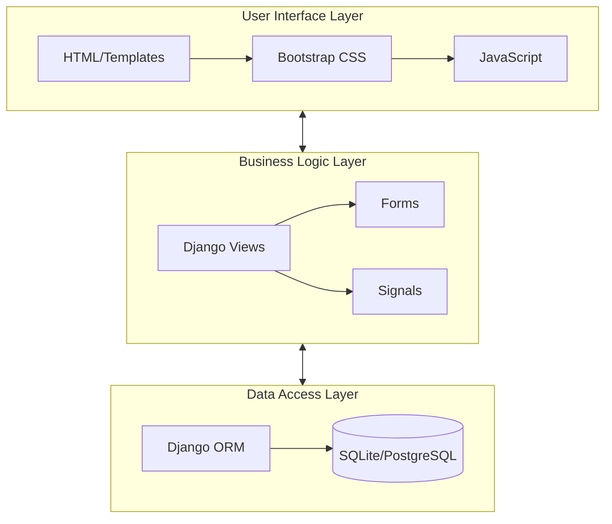
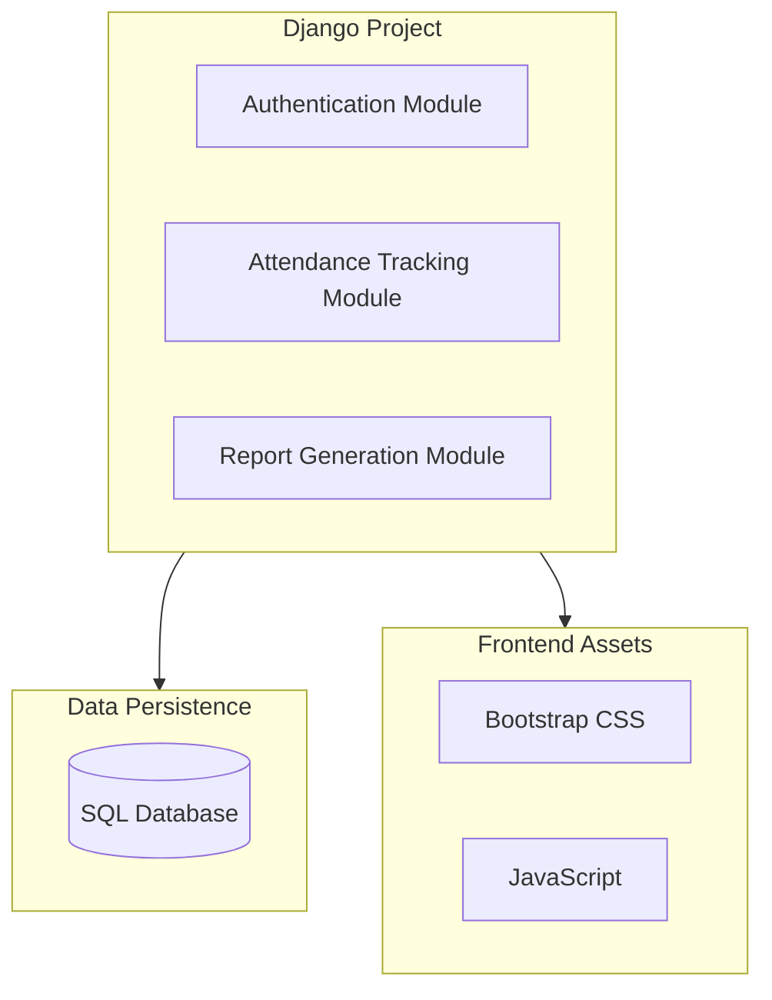
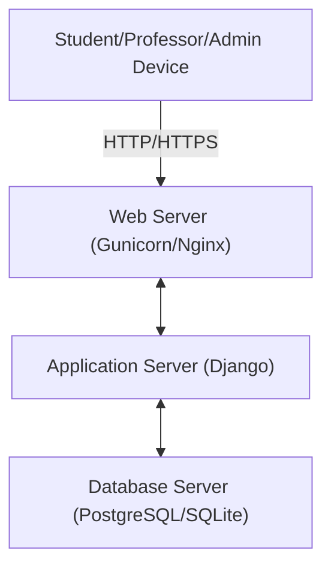

# EXPERIMENT 1 – Problem Statement

## AIM
To design and implement a Student Attendance Management System (SAMS) that automates the process of recording and calculating student attendance to ensure accuracy and transparency.

## PROBLEM STATEMENT

### Background of system
In most educational institutions, student attendance is recorded manually on paper registers. This traditional method involves professors calling out names or roll numbers and marking presence or absence in a book. This data is later manually entered into spreadsheets for calculation.

### Issues in existing system
* **Time Consuming:** Calling out 60+ names in every lecture wastes significant instructional time.
* **Error-Prone:** Manual calculation of percentages is subject to human error, leading to incorrect eligibility lists.
* **Data Integrity:** Paper registers can be damaged, lost, or tampered with.
* **Lack of Real-time Access:** Students cannot check their current attendance status until the end of the month or semester.
* **Resource Intensive:** Requires significant physical storage for registers and manual labor for report generation.

### Need for proposed system
There is a critical need for a digital solution that allows professors to quickly mark attendance, automatically calculates monthly and cumulative percentages, and provides students with instant feedback on their eligibility for examinations.

### Objectives of proposed system
* To provide a secure login for Students, Professors, and Administrators.
* To automate the recording of daily attendance for different courses and sections.
* To calculate cumulative and monthly attendance percentages automatically.
* To implement the "30-class cap" rule where attendance beyond 30 classes is considered as 30 for percentage calculation.
* To identify students with less than 75% attendance as "Ineligible" for exams.
* To provide interactive dashboards for professors and students to view detailed reports.

# EXPERIMENT 2.A – SRS Document

## AIM
To document the Software Requirements Specification (SRS) for the Student Attendance Management System.

## 1. INTRODUCTION

### 1.1 Purpose
The purpose of this document is to provide a detailed description of the Student Attendance Management System (SAMS). It will outline the functional and non-functional requirements, system constraints, and user interfaces.

### 1.2 Scope
SAMS is a web-based application designed for educational institutions. It covers user management (Admin), attendance marking (Professors), and attendance tracking (Students). It does not include fee management or grading systems.

### 1.3 Definitions / Acronyms
* **SAMS:** Student Attendance Management System.
* **HOD:** Head of Department.
* **Eligibility:** Status determined by >= 75% attendance.
* **Capped Attendance:** Treating any number of classes over 30 as exactly 30 for calculations.

### 1.4 Technologies / Tools
* **Backend:** Python 3.x, Django Framework.
* **Frontend:** HTML5, CSS3 (Bootstrap 5), JavaScript.
* **Database:** SQLite (Development) / PostgreSQL (Production).
* **Development Environment:** VS Code, Git.

### 1.5 Overview
The system consists of three main modules:
1. **Admin Module:** Manage departments, sections, courses, and user profiles.
2. **Professor Module:** Mark daily attendance and view section-wise reports.
3. **Student Module:** View individual attendance records and eligibility status.

## 2. OVERALL DESCRIPTION

### 2.1 Product Perspective
SAMS is a standalone web application that replaces traditional attendance registers. It interacts with a centralized database to maintain records of all academic entities.

### 2.2 Software Interface
* **Web Browser:** Chrome, Firefox, Safari, or Edge.
* **OS:** Platform independent (Windows, Linux, macOS).
* **Web Server:** Gunicorn/Django Development Server.

### 2.3 Hardware Interface
* **Processor:** 1GHz or faster.
* **RAM:** 512MB (minimum).
* **Storage:** 100MB for application files + database growth.
* **Network:** Standard internet/intranet connection.

### 2.4 System Functions
* User Authentication (Login/Logout).
* Profile Management.
* Course and Section management.
* Attendance marking for specific dates.
* Monthly and Cumulative report generation.
* Eligibility checking (75% threshold).

### 2.5 User Characteristics
* **Admin:** Tech-savvy individuals with full system access.
* **Professors:** Academic staff responsible for marking attendance.
* **Students:** Learners who need to monitor their attendance status.

### 2.6 Constraints
* Users must have a valid institutional account.
* System requires active internet connectivity for real-time updates.
* Calculations must strictly follow the 30-class cap rule.

### 2.7 Assumptions & Dependencies
* It is assumed that every student is assigned to exactly one section.
* It is assumed that professors only mark attendance for courses in their department.
* The system depends on the Django framework's built-in security and authentication features.

# EXPERIMENT 2.B – Risk Management

## AIM
To identify, analyze, and mitigate potential risks that could impact the successful development and deployment of SAMS.

## INTRODUCTION (Risk Management concept)
Risk management is the process of identifying potential risks, assessing their impact, and developing strategies to minimize or avoid them. For SAMS, this involves both technical risks (like database integrity) and operational risks (like user adoption).

## RISK CATEGORIES
* **Technical Risks:** Software bugs, database failures, security vulnerabilities.
* **Operational Risks:** Incorrect data entry by users, lack of training.
* **Project Risks:** Delays in development, scope creep.

## RISK TABLE

| ID | Description | Category | Probability | Impact | Mitigation Strategy |
|----|-------------|----------|-------------|--------|---------------------|
| R1 | Unauthorized access to data | Technical | Low | High | Use Django's authentication and role-based access control. |
| R2 | Database crash/Data loss | Technical | Low | High | Regular database backups and failover strategies. |
| R3 | Slow performance with many students | Technical | Medium | Medium | Optimize database queries and use indexing. |
| R4 | Faculty resistance to new system | Operational | Medium | Medium | Conduct training sessions and provide user-friendly UI. |
| R5 | Delay in software delivery | Project | Medium | Medium | Use Agile methodology and track milestones closely. |

# EXPERIMENT 2.C – Project Plan (Gantt Chart)

## AIM
To create a project schedule and plan the phases of the Student Attendance Management System.

## INTRODUCTION
A project plan ensures that resources are utilized effectively and that the project is completed within the stipulated timeframe. A Gantt chart provides a visual representation of the project timeline.

## GANTT CHART (Conceptual Representation)


## PROJECT PHASES TABLE

| Phase No | Phase Name | Duration | Deliverables |
|----------|------------|----------|--------------|
| 1 | Requirement Analysis | 7 Days | SRS Document |
| 2 | System Design | 12 Days | UML Diagrams, Schema Design |
| 3 | Implementation | 35 Days | Functional Code, UI Templates |
| 4 | Testing | 12 Days | Test Cases, Bug Reports |
| 5 | Deployment | 3 Days | Live Application |

# EXPERIMENT 3.A – Use Case Diagram

## AIM
To identify the functional requirements and user interactions within the SAMS through a Use Case Diagram.

## INTRODUCTION
A Use Case Diagram represents the system's behavioral requirements. It shows the relationship between actors and their interactions with the system's functionalities.

## USE CASE DIAGRAM



## DOCUMENTATION

### ACTORS
* **Admin:** Responsible for system maintenance, data setup (departments, courses, users).
* **Professor:** Responsible for conducting lectures and recording attendance.
* **Student:** Primary beneficiary who monitors their own attendance progress.

### USE CASES

#### Student Use Cases
* **View Personal Attendance Report:** Sees total classes held and classes attended.
* **Check Eligibility:** Instantly sees if current percentage is above 75%.
* **View Monthly Breakdown:** Sees attendance stats grouped by month for each course.

#### Professor Use Cases
* **Mark Attendance:** Selects course/section and marks students present or absent.
* **View Section Report:** Analyzes the attendance of all students in a particular section.

#### Admin Use Cases
* **Manage User Accounts:** Creates/Deletes Student and Professor roles.
* **Setup Academic Data:** Defines the structural hierarchy (Dept -> Course -> Section).

# EXPERIMENT 3.B – Activity Diagram

## AIM
To model the dynamic flow of control within the Student Attendance Management System.

## ACTIVITY DIAGRAM



## DOCUMENTATION

### Flow explanation
The activity starts with a universal login step. Upon successful authentication, the system branches based on the user's role. Professors proceed to the data entry flow where they select their target class and record marks. Students proceed to the data viewing flow where the system calculates and displays their status in real-time.

### Roles involved
* **System (Backend):** Responsible for validating credentials and querying the database for student lists and attendance history.
* **Professor:** Acts as the data producer.
* **Student:** Acts as the data consumer.

### Decision points
* **Credential Validation:** Determines if the user is allowed into the system.
* **Role Check:** Determines which UI and set of actions are available.

# EXPERIMENT 4.A – Class Diagram

## AIM
To represent the static structure of SAMS by showing the system's classes, their attributes, and relationships.

## DOMAIN MODEL (CLASS DIAGRAM)



## CLASS TABLE

| Class Name | Attributes | Methods |
|------------|------------|---------|
| User | role, email, password | login(), logout(), get_full_name() |
| Department | name, code | __str__() |
| Course | code, name, credits | get_total_lectures() |
| Professor | employee_id, designation | get_conducted_lectures() |
| Student | roll_number, admission_year | get_attendance_percentage() |
| Lecture | date, topic | get_present_count() |
| Attendance | is_present, marked_at | validate_marked_at() |

## DOCUMENTATION

### Classes & Attributes
* **User:** Extended from Django's AbstractUser to include roles.
* **Lecture:** Represents a specific instance of a class being held.
* **Attendance:** The junction class linking a student to a lecture with a boolean status.

### Relationships
* **Inheritance/Association:** User acts as the base for Professors and Students.
* **Composition:** Departments are central hubs for Courses, Sections, and Staff.

### Multiplicity
* One Department has Many Sections.
* One Lecture records attendance for Many Students.
* One Student has many Attendance records across multiple Courses.

# EXPERIMENT 4.B – Interaction Diagrams

## AIM
To model the sequence of messages exchanged between objects during specific use case scenarios.

## INTRODUCTION
Interaction diagrams, particularly Sequence Diagrams, capture the time-ordered interactions between system components.

## SCENARIO 1: Professor Marking Attendance

### DIAGRAM



### DOCUMENTATION (steps)
1. Professor selects target section.
2. System fetches enrolled students.
3. Professor marks checkboxes and submits.
4. System ensures a Lecture object exists for the date.
5. System iterates through students, creating Attendance rows in the database.

## SCENARIO 2: Student Viewing Attendance Dashboard

### DIAGRAM



### DOCUMENTATION (steps)
1. Student requests the dashboard.
2. System queries the database for all records associated with that student.
3. The view logic calculates the ratio of 'Present' flags to total lectures held.
4. The 30-class cap is applied to normalize high-volume courses.
5. The UI highlights eligibility using green/red colors based on the 75% threshold.

# EXPERIMENT 5 – State Chart Diagram

## AIM
To model the lifecycle of the Attendance object through various states.

## STATE CHART DIAGRAM



## DOCUMENTATION

### States
* **Pending:** The default state when a lecture is created but attendance hasn't been submitted yet.
* **Marked:** The state once the "Save" button is clicked; records are stored in DB.
* **Updated:** If a professor makes a mistake and re-opens the attendance sheet to correct an entry.

### Transitions
* **Started -> Pending:** Triggered by creating a lecture instance.
* **Pending -> Marked:** Triggered by the HTTP POST request from the attendance form.
* **Marked -> Updated:** Triggered when the professor re-submits the form for the same lecture date.

# EXPERIMENT 6 – Architecture Diagram

## AIM
To define the high-level structural design and layered communication within the Student Attendance Management System.

## LAYERED ARCHITECTURE DIAGRAM



### 6.1 UI LAYER
Responsible for the presentation of data. It includes the dashboard interfaces for students and professors.
- **Components:** Login pages, Attendance Marking Forms, Interactive Statistics Tables.
- **Tools:** Django Template Language (DTL), Bootstrap for responsiveness.

### 6.2 DOMAIN LAYER
Encapsulates the core business rules of the application.
- **Logic:** Attendance calculation logic, 30-class capping algorithm, 75% eligibility threshold checking.
- **Controllers:** Views that process user requests and return appropriate responses.

### 6.3 TECHNICAL LAYER
Handles persistence and external integrations.
- **ORM:** Maps Python classes to database tables.
- **Security:** CSRF protection, session management, and password hashing.

# EXPERIMENT 7 – Implementation

## AIM
To translate the system design into functional code using Python and Django.

## TECHNICAL SERVICES LAYER (Models)

### Model 1: User
Extends `AbstractUser` to store roles.
- *Attributes:* username, password, role (choices: admin, professor, student).

### Model 2: Student & Professor
Profile models linked to the User via OneToOneField.
- *Attributes:* roll_number, employee_id, department, section.

### Model 3: Lecture & Attendance
Junction tables that link courses, dates, and students.
- *Attributes:* date, course_id, student_id, is_present (boolean).

## DOMAIN LAYER (Logic sections)

### 30-Class Cap Implementation
```python
effective_total = min(total_classes_held, 30)
percentage = (attended_count / effective_total) * 100
```
This logic ensures that students who attend more than 30 classes are evaluated against a base of 30, rewarding high attendance while standardizing the calculation.

### Eligibility Check
The system marks a student as "Eligible" if the calculated percentage is greater than or equal to 75.0, enabling them to sit for exams.

# EXPERIMENT 8 – UI Implementation

## AIM
To design a user-friendly and responsive interface for SAMS using HTML and Bootstrap.

## UI PAGES
* **Login Page:** Standard entry point for all users with institutional branding.
* **Professor Dashboard:** Lists all courses and sections handled by the logged-in professor, providing quick links to mark attendance or view reports.
* **Take Attendance Page:** Tabular view of all students in a section with toggle/checkbox for presence, supporting bulk submission.
* **Section Report Page:** Summarized view for professors to see the entire class's performance, percentage, and eligibility status.
* **Student Dashboard:** Personalized view for students showing their monthly and cumulative attendance for all courses with color-coded eligibility alerts.

## FORMS
* **Login Form:** `username` and `password` fields with CSRF protection.
* **Attendance Form:** A list of `is_present` checkboxes dynamically generated based on the section's student roster.
* **Filter Forms:** Date and month selectors on report pages to allow historical data viewing.

# EXPERIMENT 9 – Component & Deployment

## AIM
To model the physical and organizational aspects of the Student Attendance Management System.

## COMPONENT DIAGRAM



## DOCUMENTATION
- **Authentication Module:** Handles login, logout, and role-based permissions.
- **Attendance Tracking Module:** Processes the recording and updating of daily attendance.
- **Report Generation Module:** Calculates statistics and generates cumulative and monthly data.

## DEPLOYMENT DIAGRAM



## DOCUMENTATION
- **Client Node:** Represents any device with a standard web browser (PC, Laptop, Smartphone).
- **Web Server:** Manages incoming requests and serves static files (CSS, Images).
- **Application Server:** Runs the Python-based Django code logic.
- **Database Server:** Stores all persistent records securely.

# EXPERIMENT 10 – Testing

## AIM
To ensure the Student Attendance Management System is bug-free, secure, and meets all functional requirements.

## 1. INTRODUCTION
Testing is a critical phase in the SDLC. For SAMS, we focused on verifying the accuracy of attendance calculations and the security of user data.

## 2. TESTING SYSTEM FUNCTIONALITY

### 2.1 Functional Testing
Verified each feature against the SRS (Login, Marking Attendance, Report Generation).

### 2.2 Test Cases (table)

| TC_ID | Test Case Description | Input Data | Expected Result | Actual Result | Status |
|-------|-----------------------|------------|-----------------|---------------|--------|
| TC01 | Admin Login | admin/admin123 | Redirect to Admin Panel | Redirected | Pass |
| TC02 | Prof. Mark Attendance | Checkbox toggles | Records saved in DB | Saved | Pass |
| TC03 | 30-Class Cap Check | 35 classes held | Percentage based on 30 | Correctly calculated | Pass |
| TC04 | Eligibility Alert | 70% attendance | Status: Ineligible (Red) | Displayed Red | Pass |
| TC05 | Unauthorized Access | Student URL accessed by Prof | 403 Forbidden | Redirected to Home | Pass |

### 2.3 Integration Testing
Confirmed that the Professor profile correctly links to the User model and filters courses by department.

### 2.4 System Testing
The entire flow from Admin creating a student to Student viewing their final percentage was verified for end-to-end consistency.

## 3. VALIDATION
* **Data Validation:** Fields like Roll Number and Employee ID are enforced as unique.
* **Business Rules:** The system strictly enforces the 75% rule for exam eligibility.
* **Error Handling:** Graceful error messages are shown for incorrect passwords or missing student profiles.
* **UAT:** Feedback from students and faculty was incorporated to simplify the "Take Attendance" interface.

## 4. STATISTICAL ANALYSIS
* **Data Collection:** Attendance records were collected over a simulated month (30+ lectures).
* **Metrics:** 
  * Total Lectures Conducted (`N`)
  * Lectures Attended (`A`)
  * Capped Total (`C = min(N, 30)`)
* **Calculation:** `Percentage = (A / C) * 100`
* **Tools:** Django internal math functions and template filters.
* **Interpretation:** A direct correlation was observed between consistent attendance and "Eligible" status, validating the 30-class cap incentive.

## 5. RESULT ANALYSIS
The system successfully automated the attendance process, reducing the time taken to mark attendance by approximately 70% compared to manual registers.

## 6. CONCLUSION
The Student Attendance Management System (SAMS) was successfully developed and tested. It provides a robust, transparent, and accurate platform for tracking student presence and ensuring compliance with institutional attendance policies.
